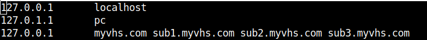

# Virtual-Hosting-Server in Node.js

## Introduction

This is our implementation of the Virtual Hosting Server project.

`Note` For virtual hosts to work properly on a local machine, you need to include them into the 

- on Linux -  `/etc/hosts` file

- on Windows - `C:\Windows\System32\drivers\etc\hosts`

The screenshot below illustrates an example of how it would look (taken on Ubuntu Linux)



## Installation

Clone this repository, then run

```
npm install
```

## Starting the server

The VHS runs on the port 8500. To start it, run

```
npm run start
```

To run the admin server, run

```
npm run admin
```

### Participants

The project was written by **Hrach Davtyan** and **Davit Sahakyan**.