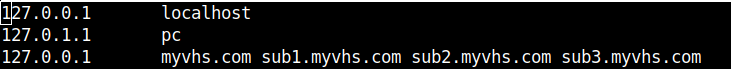

# Virtual-Hosting-Server in Node.js

## Introduction

This is our implementation of the Virtual Hosting Server project.

## Description

We used Node.js as the programming language for this project because we both had much more experience working with it than any other language. The program allows the end user to host their own website under the domain of the server itself. Every subdomain does not require its own hosting server; that's the Virtual part of the Virtual Hosting Server.

#### User Capabilities

Our virtual hosting server currently has two user groups.

- Regular users

    Regular users can visit a subdomain on the VHS to see the static content that an admin user has previously created for this subdomain.

- Admin users

    Admins can create, manage, and delete subdomains and upload and manage static content for each subdomain.

#### Modules used

To achieve this functionality, we have used the following Node.js modules`

For the server.js, 

- The `net` package provides a convenient interface to work with sockets; this is the main package that allowed this project to be implemented in Node.js

- `fs` allows to work with the file system of the server, reading the host data stored in a JSON file and reading the static content from the local path when someone visits a specific subdomain

- `path` for smart local file path handling

As for the admin.js`

- `net` is again used as the base for the admin server, with sockets used. Serving the admin panel, accepting add and delete POST requests - all of this is done using the net package

- `fs` and `path` again allow us to create new/update/delete the virtual hosts locally.

- `querystring` for parsing incoming POST request body data (currently, only the functionality for /add and /delete is implemented)

### Note

 For the sake of <b>security and simplicity</b>, we have not provided automatic /etc/hosts file editing via fs. The program has not been tested to the point where it would be safe for us to have it change system network files. That is why we have left it to the end user to manage changes to the /etc/hosts file.
 
 For virtual hosts to work correctly on a local machine, you need to include them in the 

- on Linux -  `/etc/hosts` file

- on Windows - `C:\Windows\System32\drivers\etc\hosts`

The screenshot below illustrates an example of how it would look (taken on Ubuntu Linux)



## Installation

Clone this repository, then run.

```
npm install
```

## Starting the server

The VHS runs on the port 8500. To start it, run

```
npm run start
```

To run the admin server, run

```
npm run admin
```

## Participants

The project was written by **Hrach Davtyan** and **Davit Sahakyan**.